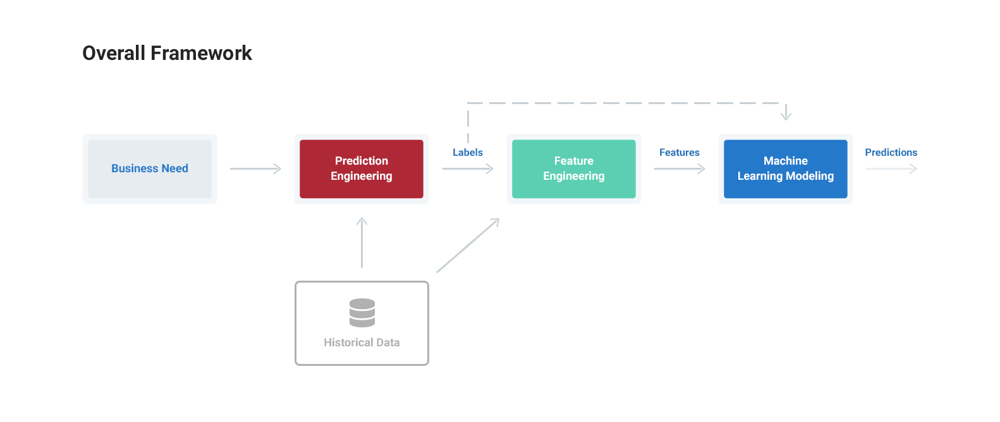
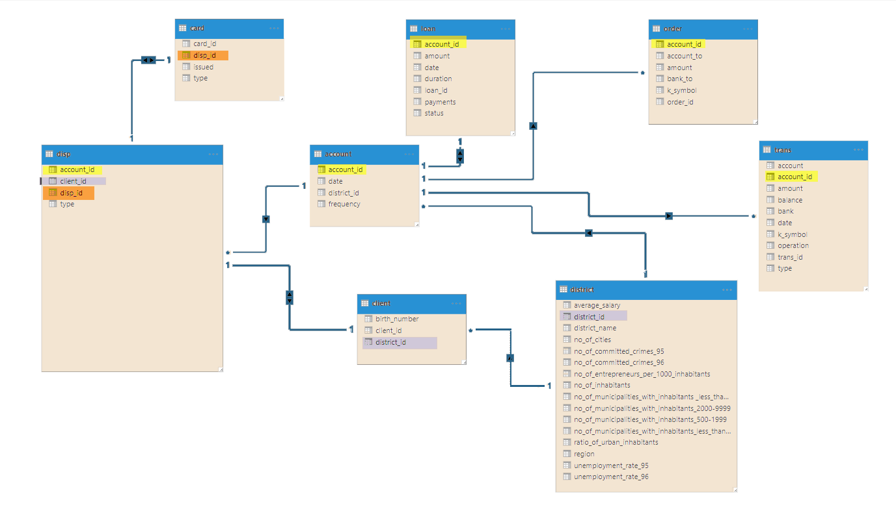
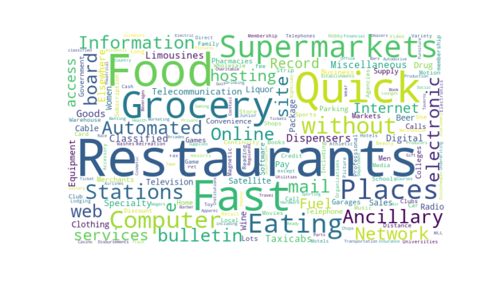

# Travel Rewards Mastercard® Predictive Marketing - Machine Learning In Customer Analytics

## Background
The project was a case competition solution presented by the Team 3, for ATB Datathon, which aimed to bring together Canada’s leading minds in the fields of data science, artificial intelligence, machine learning, and other disciplines, to foster diverse discussions and problem solving, during March 30-31, 2019. The assigned theme was Customer Analytics with an anonymized credit-card-transaction dataset provided. 

## Problem Statement

The dual mandate of improving customer experience and banking revenue require tailor marketing of right product, to right customer and in right time. The "Travel Rewards Mastercard Predictive Marketing" model aims to predict travelling customer in the next month, and the ariline to use, based on previous credit card transaction behaviors. The bank can therefore make each Travel Rewards Mastercard offer tailored to the customer, airline transaction and timeframe. 

## Data
The Transaction table include 137,794 records with date, time, account ID, amount and Merchant Category Code. Other data include the mapping between account. The Account table include the Many-to-Many mapping beween customers and accounts. The Customer table include customers' demographic infomation.

## Pre-processing

## Feature Engineering
### Visulize the keywords of 360+ transaction categories

