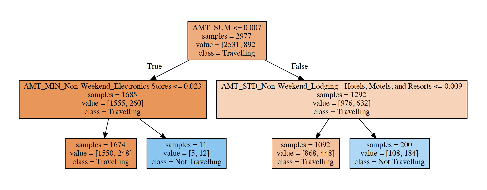

# Travel Rewards Mastercard® Predictive Marketing - Machine Learning In Customer Analytics

## Background
The project was a case competition solution presented by the Team 3, for ATB Datathon, which aimed to bring together Canada’s leading minds in the fields of data science, artificial intelligence, machine learning, and other disciplines, to foster diverse discussions and problem solving, during March 30-31, 2019. The assigned theme was Customer Analytics with an anonymized credit-card-transaction dataset provided. 

## Problem Statement
The dual mandate of improving customer experience and banking revenue require tailor marketing of right product, to right customer and in right time. The "Travel Rewards Mastercard Predictive Marketing" model aims to predict travelling customer in the next month, and the ariline to use, based on previous credit card transaction behaviors. The bank can therefore make each Travel Rewards Mastercard offer tailored to the customer with **specified airline and timeframe for extra points**. 

## Data
The Transaction table include 137,794 records with date, time, account ID, amount and Merchant Category Code, from Jan 01 to Mar 31 in 2018. Other data include the mapping between account. The Account table include the Many-to-Many mapping beween customers and accounts. The Customer table include customers' demographic infomation.
### The keywords of 360+ transaction categories

## Pre-processing
To impute missing values, normalize and merge datasets as needed.

## Prediction Engineering
As the first iteration, we encode the customers who make travelling spending (hotels or airlines) in March, as travelling customers. In future iterations, we can encode the customers who spends on specific airline or hotel company in March.

## Feature Engineering
The idea is to  group transctions by customer, and find possible combinations of **"Recency, Frequncy, Monetary"**, **time cycles** (Day of Week, Weekend or Weekdays, etc), and **category groups**. This is achieved by **3 levels of extraction stages**. First level is to simply calculate the spending sum, mean, std, etc over Jan and Feb, plus the most recent amount and the days past. Second level is to repeat the first level once sub-grouped by categories, and once sub-grouped by time cycles. The third level is to repeat the first level, sub-grouped by time cycle AND categories. **Starting with only 6 columns per transaction, now we have 7754 features (sparse) for each customer.**
Noted that we originally have 365 merchant categories, with top 20% categories represent 90% transactions. So, we keep the categories with high occurances, while furthur group the cateogories with less than 0.2% occurence with CitiGroup's standard MCC Grouping. By doing so, we reduce the categories from 365 to 120. 
### Citigroup's MCC Grouping

## Machine Learing Modelling
Due to the high-dimentional sparse features, we start Logistic Regression to test the outcomes of previous steps. And we use Pipelines and Grid Search to fit, cross-validate and tune Logistic Regression, Decision Tree and Random Forest Classifier on scaled trainining dataset. Due to the **imbanlanced class distribution**, we focus on **AUC Score**, which reflect the model's performance to differentiate positive v.s. negative class. 
### Model Performances with Normalized Confusion Matrix

## Model Interpretation 
### Sample Decision Tree, First 2 Levels

### Feature Importances From Decision Tree

### Future Iterations
As shown below, predicting travelling with specific merchant is extremely imbalanced classification task. We do not continue with company-level prediction due to limited samples, computing resources and only 48 hours of time. The good news is, we design "Travel Rewards Mastercard Predictive Marketing" model in such way to allow the model to scale with input data, and has to flexibility to switch prediction of interest easily. For example, including "Day of Month" or "Hour of Day" into time cycles will contribute to additional 10,000+ features each. 

### Flight Popularity in Canada

### Extremely Imbalanced Labelling

-----

## Presented by 

### ATB Datathon Team 3

#### Petrina Akor, Administration 

#### Arenna Bu, Business Consulting

#### Muhan Guna, Data Visulization

#### Yingkai He, Predictive Modelling 

#### Virina Mekhail, Data Engineering

#### Nooshin Dehghanian, Quality Control

##  ---THANK YOU---
